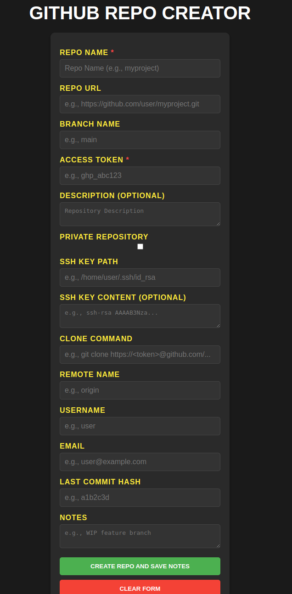
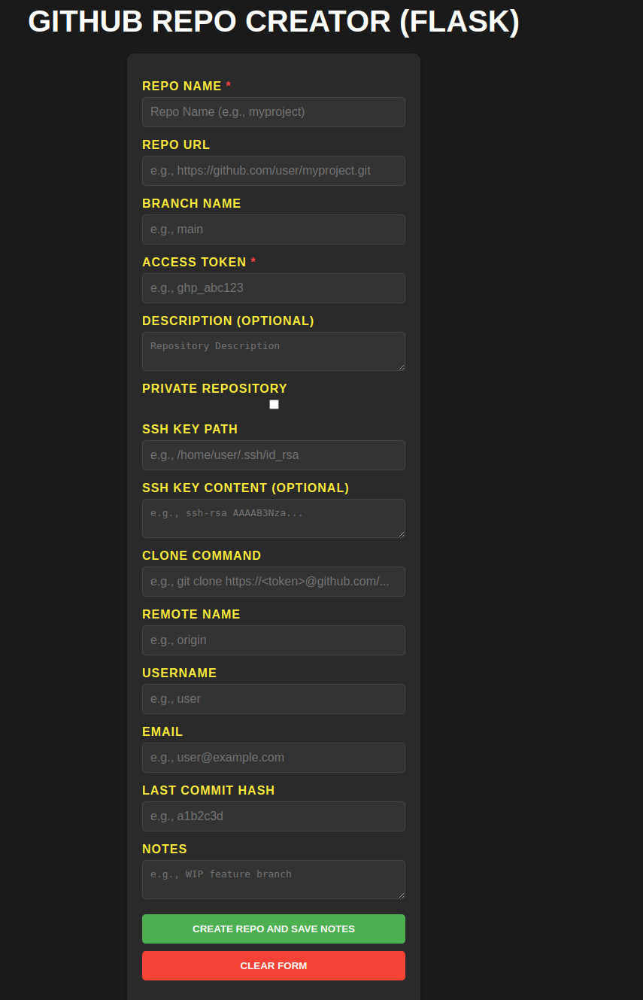
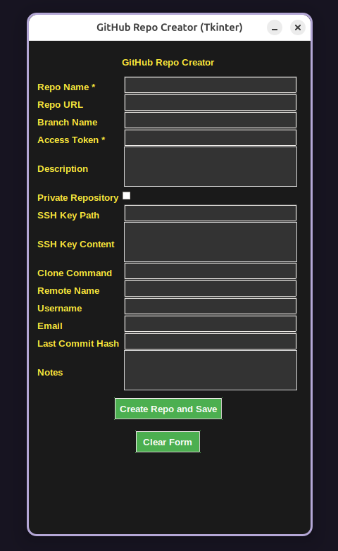

GitHub Repo Creator

Overview

- **Web (Static)**: Browser-based using HTML/CSS/JS.
- **Web (Flask)**: Python-powered web app using Flask.
 - **Web (Tkinter)**: Python-powered  using Tkinter.

## Screenshots
### Web Version

### Flask Version

### Tkinter Version

The GitHub Repo Creator is a simple web-based or Python Flask/Tkinter tool that allows users to create a GitHub repository directly from a browser interface and save repository details and Git commands to a text file. It’s designed for developers who want a quick way to set up a new repo without leaving their browser, with a modern dark-themed UI.

Features

Create GitHub Repositories: Generate a new repo on GitHub with options for name, description, and privacy settings.
Save Details: Downloads a .txt file with repo info (e.g., URL, clone command) and recommended Git commands.
Customizable Fields: Input optional details like branch name, SSH key path, username, email, and notes.
Modern UI: Black background, yellow labels, white input text, and a sleek design with hover effects.
Form Reset: Clear all fields with a single button click.
Error Handling: Displays success or error messages after repo creation attempts.

Requirements

Browser: A modern web browser (e.g., Chrome, Firefox, Edge) with JavaScript enabled.
**Web (Flask)**: Python 3.x, Flask, `requests` library.

GitHub Personal Access Token: A token with repo scope to authenticate API requests (generate one in GitHub Settings > Developer Settings > Personal Access Tokens).

Local Server: A simple server to host the files (e.g., Python’s http.server), as the GitHub API requires http:// or https:// (not file://) due to CORS.

Setup

Clone or Download:
Clone this repository or download the files: index.html, styles.css, script.js, and README.md.

File Structure:

github-repo-creator/
├── web/
│   ├── index.html
│   ├── styles.css
│   ├── script.js
├── python/
│   ├── app.py           # Flask app
│   ├── templates/
│   │   ├── index.html  # Form template
│   ├── static/
│   │   ├── styles.css  # CSS file
├── README.md

Run a Local Server:

Navigate to the project folder in your terminal.
Use Python’s built-in server (if Python is installed):

python -m http.server 8000
Or use any other local server tool (e.g., npx serve, VS Code Live Server).
Access the Tool:
Open your browser and go to http://localhost:8000 (or the port your server uses).
Usage
Open the Page:
Visit the local server URL (e.g., http://localhost:8000).
Fill Required Fields:
Repo Name: Enter a unique name for your GitHub repository (required).
Access Token: Paste your GitHub Personal Access Token (required).
Optional Fields:
Add details like description, branch name, SSH key info, username, email, etc., as needed.
Create Repository:
Click Create Repo and Save Notes.
If successful, a .txt file (e.g., myproject_repo_info.txt) will download with repo details and Git commands.
A green success message will appear; otherwise, a red error message will show.
Reset Form:
Click Clear Form to reset all fields and messages.
Use the Output:
Open the downloaded .txt file for repo details and copy-paste the Git commands into your terminal as needed.

Example Output File

Repository Details:
Name: myproject
URL: https://github.com/username/myproject
Branch Name: main
Access Token: ***HIDDEN*** (Original: 40 chars)
Description: My cool project
Private: false
SSH Key Path: /home/user/.ssh/id_rsa
SSH Key Content: ssh-rsa AAAAB3Nza...
Clone Command: git clone https://github.com/username/myproject.git
Remote Name: origin
Username: username
Email: user@example.com
Last Commit Hash: N/A
Notes: Initial setup
GitHub Created URL: https://github.com/username/myproject

Recommended Git Commands:
# Initialize local repository (if starting fresh)
git init
git config user.name "username"
git config user.email "user@example.com"
# Clone the repository
git clone https://github.com/username/myproject.git
cd myproject
# Set up remote
git remote add origin https://github.com/username/myproject.git
# Verify remote
git remote -v
# Checkout branch (if not default)
# Default branch is main
# Add SSH key (if provided)
ssh-add "/home/user/.ssh/id_rsa"
# Example commit (if initialized locally)
# git add .
# git commit -m "Initial commit"
# git push origin main

Notes

Security: Keep your access token private; it’s hidden in the output file but stored in memory during use.
Limitations: This is a browser-based tool, so it can’t execute Git commands or manage SSH keys directly—those steps are manual.
CORS: Serve via a local server to avoid CORS issues with the GitHub API.
Troubleshooting
"Error: Bad credentials": Check your access token’s validity and repo scope.
No file downloads: Ensure your browser allows downloads and there’s no JavaScript error (check console with F12).
Blank page: Verify all files are in the same directory and the server is running.
